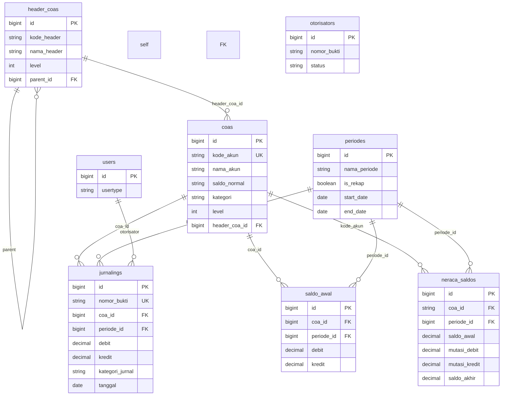
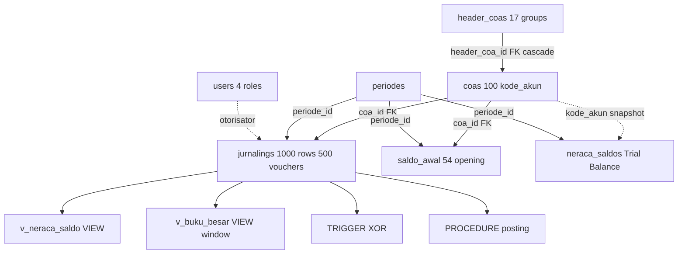
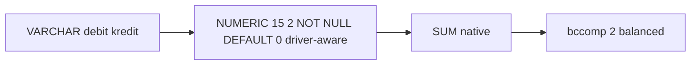

# DAPENSE — Dana Pensiun Sekolah Kristen Salatiga

> Pension Fund Accounting System · **MySQL 8.4 (prod OLTP)** | **PostgreSQL 16-alpine (portable alt)** | **SQLite (fallback)** — one active via `DB_CONNECTION` (`config/database.php:19`)
> Laravel 13 · PHP 8.3 · Eloquent ORM · Livewire 4 · Docker · Ubuntu · Redis 7 · Nginx
> Private pension-fund ledger with 3NF chart-of-accounts, double-entry journals, period-close, and role-gated reporting. Indonesian terms in *italics*.

     

---

## TL;DR

- **3NF Database** — 8 core tables, 8 FKs (`constrained()->onDelete('cascade')`), 3 domain uniques, 19 migrations (18 schema + 1 seed) — hierarchy `HeaderCOA (Kelompok Akun)` 1—N `COA (Akun)` 1—N `Jurnaling (Jurnal)` → `Saldo Awal` / `Neraca Saldo (Trial Balance)` — 100 COAs, 1,000+ journal lines verified (`database/seed_data_jurnal_coa.sql:11-28,39-139,144-198,203ff`)
- **Correctness** — `VARCHAR(255)` → `NUMERIC(15,2)` driver-aware (`2026_08_03_000001:13-21`, `Jurnaling.php:42-43` `decimal:2`) + `bccomp(...,2)` balanced guard (`JurnalingController:467-468`) + `SUM(debit/kredit)` reconciliation (`NeracaSaldoController:107,115`) across all reports
- **Ops & Access** — 4 roles `rootsuperuser/admin/operator/bod` (8 Policies, 4 Gates, `HasRole`/`CheckRole`), AES-256-CBC encrypted `mysqldump/pg_dump` backups (30d, `docker/backup*.sh`), MySQL 8.4 ↔ PG 16 portability (driver-aware `USING ::numeric` + `pgloader`, `docs/postgres-migration.md`)

---

## Quick Start

```bash
# MySQL 8.4 — default (prod OLTP)
docker compose up --build -d
docker compose exec app php artisan migrate --force
docker compose exec mysql mysql -u root -p"$DB_PASSWORD" dapense < database/seed_data_jurnal_coa.sql
# or: docker compose exec app php artisan db:seed --class=DatabaseSeeder

# PostgreSQL 16 — portable alternative
docker compose -f docker-compose.pgsql.yml up --build -d
docker compose -f docker-compose.pgsql.yml exec app php artisan migrate --force
docker compose -f docker-compose.pgsql.yml exec postgres psql -U postgres -d dapense -f database/seed_data_jurnal_coa.sql

# Verify
docker compose exec mysql mysql -u root -p"$DB_PASSWORD" dapense -e "SELECT COUNT(*) FROM coas; SELECT COUNT(*) FROM jurnalings;"
# + showcase (synthetic, no PII): docs/sql-showcase.md, database/sql-showcase/
```

SQLite is the zero-config fallback when `.env` is missing (`config/database.php:37`); `:memory:` in `phpunit.xml:26-27` is commented out (needs MySQL for VARCHAR regression).

---

## Architecture at a Glance

**Layers:** `Transport / Handler (Livewire / Controllers)` → `Application / Service` → `Domain` → `Repository (Eloquent)` → `Infrastructure (MySQL/PG, Redis, Nginx)` — see `docs/database-portfolio.md §6` for detail.

**Roles (4) & Enforcement:**

| Role | Access | Source |
|---|---|---|
| `rootsuperuser` | Full — posts periods, manages users/periods, all reports | `users.usertype` default `2024_06_17_033310:18`, `AuthServiceProvider:36-50` |
| `admin` | Masters (COA/header), journals, reports | `HasRole` trait, `CheckRole` middleware `bootstrap/app.php:20` |
| `operator` | Journal entry (create/edit), own scope | `JournalPolicy`, `LedgerPolicy` |
| `bod` (Board) | Read/audit reports | `ReportPolicy` |

8 Policies (`Journal, Ledger, User, Periode, SaldoAwal, Otorisator, Report, Setting`) + 4 Gates (`export-journal:36, import-data:40, post-journal:44, manage-users:48`) — server-side, never frontend-only (`AGENTS.md:14`).

**Period Lifecycle:** `periodes.is_rekap` drives open → `is_rekap=true` (closed) → `neraca_saldos` snapshot. Voucher integrity per period via `UQ(nomor_bukti, periode_id)` (`2026_07_26_000001:12`, re-added `2026_08_02_000002`).

---

## Database Spotlight

### ERD — 8 Core Tables (3NF)



### Relation Flow



Solid = FK `constrained()->onDelete('cascade')` auto-indexed. Dashed = natural-key snapshot (`neraca_saldos.coa_id → coas.kode_akun` `2024_09_07_064446:17`) / approver link. Spine: 5 top headers → 17 leaf → 100 COAs → journals.

### FK Catalogue (8)

| # | From → To | Migration | Delete |
|---|---|---|---|
| 1 | `coas.header_coa_id → header_coas.id` | `2024_07_12_160105:19` | cascade |
| 2 | `header_coas.parent_id → header_coas.id` (self) | `2024_07_12_155920:19` | cascade |
| 3 | `saldo_awal.coa_id → coas.id` | `2024_08_10_114736:16` | cascade |
| 4 | `saldo_awal.periode_id → periodes.id` | `2024_08_10_114736:20` | cascade |
| 5 | `jurnalings.coa_id → coas.id` | `2024_08_02_072943:22` | cascade |
| 6 | `jurnalings.periode_id → periodes.id` | `2024_08_02_072943:23` | cascade |
| 7 | `neraca_saldos.coa_id → coas.kode_akun` | `2024_09_07_064446:17` | cascade |
| 8 | `neraca_saldos.periode_id → periodes.id` | `2024_09_07_064446:18` | cascade |

**Uniques (3):** `UQ(kode_akun)` + `UQ(kode_akun,nama_akun)` (`2024_07_12_160105:24-25`) + `UQ(nomor_bukti, periode_id)` (`2026_07_26_000001:12`).

**Migrations (19 = 18 schema + 1 seed):** `users → periodes → header_coas → coas → jurnalings → saldo_awal → neraca_saldos → otorisators → activity_log → UQ add/drop → NUMERIC conversion ★ → seed` (`database/migrations/`, `database/seed_data_jurnal_coa.sql`).

**Seed (verified):** 17 headers `:11-28`, 100 COAs `:39-139`, 54 saldo_awal `:144-198`, 1,000 jurnalings `:203ff` (500 vouchers ×2, balanced).

### Optimization — VARCHAR → NUMERIC(15,2)



`2026_08_03_000001:13-21` — MySQL `MODIFY NUMERIC`, PG `ALTER TYPE USING ::numeric` · `Jurnaling.php:42-43` `decimal:2` · `saldo_akhir = (awal.debit - kredit) + (mutasi.debit - kredit)` (`NeracaSaldoController:115`).

---

## SQL Showcase (Synthetic, No PII)

Runnable vs dummy seed on both engines — `database/sql-showcase/`:

| File | Proves | Mirrors |
|---|---|---|
| `01_views.sql` | `v_neraca_saldo` + `v_buku_besar` (`SUM OVER PARTITION BY` running balance) | `NeracaSaldoController:107,135` `BukuBesarController:56,119` |
| `02_triggers.sql` | `trg_jurnal_balance_check` `debit XOR kredit` | `JurnalingController:467-468` |
| `03_procedures.sql` | `sp_posting_periode(p_periode_id)` transactional snapshot | `PostingController:88-95` |
| `04_complex_joins.sql` | 3 JOINs: COA×month, Neraca `LEFT JOIN`, Laba-Rugi `WITH` CTE + voucher audit | `seed_data:11ff` |

**2-minute verifier:**

```sql
SELECT kode_akun, mutasi_debit, saldo_akhir FROM v_neraca_saldo WHERE periode_id=1 LIMIT 10;
INSERT INTO jurnalings (nomor_bukti,coa_id,periode_id,debit,kredit,tanggal,keterangan) VALUES ('OK',1,1,50000,0,'2025-06-15','ok');
-- second should SIGNAL/RAISE:
INSERT INTO jurnalings (nomor_bukti,coa_id,periode_id,debit,kredit,tanggal,keterangan) VALUES ('BAD',1,1,50000,50000,'2025-06-15','fail');
CALL sp_posting_periode(1); SELECT COUNT(*) FROM neraca_saldos WHERE periode_id=1; -- 100
```

---

## Ops

**Backups:** `mysqldump/pg_dump | gzip | openssl enc -aes-256-cbc -salt -pbkdf2 -pass $BACKUP_ENCRYPTION_KEY > /backups/dapense_*.sql.enc` (`docker/backup.sh:27`, `backup-pg.sh:38`, `restore.sh:43`, `restore-pg.sh:45`, `config/app.php:98` `AES-256-CBC`, 30d retention).

**Portability:** MySQL `BIGINT UNSIGNED` backticks `MODIFY` ↔ PG `BIGINT` `ALTER TYPE USING ::numeric` (`2026_08_03:13-21`); seed already PG-compatible plain `INSERT` (`docs/postgres-migration.md:12`); `pgloader mysql:// pgsql://` or `./database/pgsql-export.sh → pgsql-dump/full.sql`.

---

## Docs Map

| Doc | What |
|---|---|
| `docs/database-portfolio.md` | **Single source** — merges CV + deep-dive + showcase, full ERD flowchart + citation index (this README is the entry point) |
| `docs/sql-showcase.md` | Showcase narrative + how to run |
| `docs/postgres-migration.md` | MySQL → PG guide + `pgsql-export.sh` |
| `database/sql-showcase/*.sql` | Runnable `VIEW`/`TRIGGER`/`PROCEDURE`/`JOIN` demo |

---

## Citation Index (file:line)

`2024_07_12_155920:19` · `2024_07_12_160105:19,24-25` · `2024_08_02_072943:20-23` · `2024_08_10_114736:16,20` · `2024_09_07_064446:17-18` · `2026_07_26_000001:12` · `2026_08_03_000001:13-21` · `seed_data_jurnal_coa.sql:11-28,39-139,144-198,203ff` · `Jurnaling.php:42-43,47` · `NeracaSaldoController:107,115,135` · `BukuBesarController:56,119,189` · `PostingController:88-95` · `JurnalingController:467-468` · `config/database.php:19,32-60,82-95` · `docker-compose.yml:47-48` · `docker-compose.pgsql.yml:21,56` · `.env.example:24,36` · `AuthServiceProvider:36-50` · `bootstrap/app.php:20` · `HasRole.php` · `backup.sh:27` · `config/app.php:98`

---

*All showcase SQL is synthetic anonymized (no PII/production balances). Verify: `SELECT COUNT(*) FROM coas -- 100` etc. See `docs/database-portfolio.md` for full deep-dive.*
