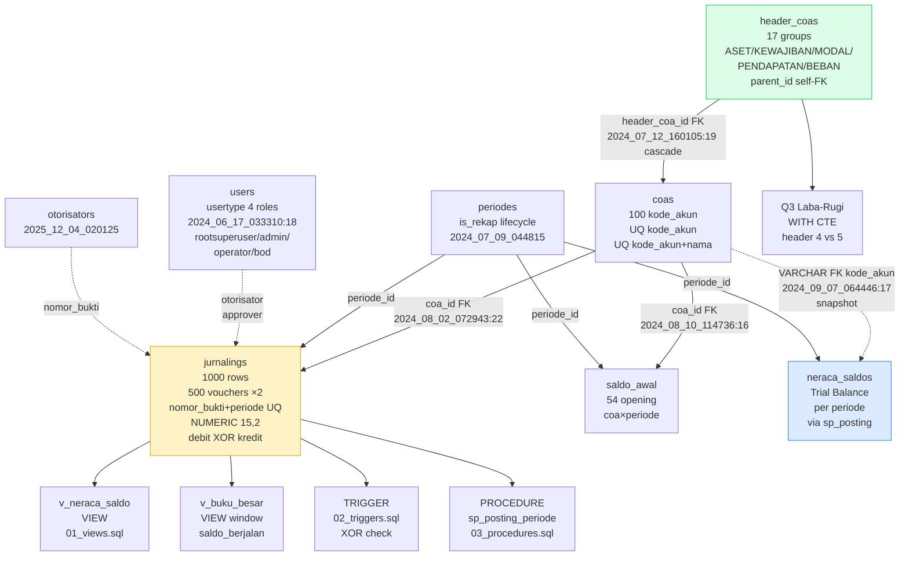
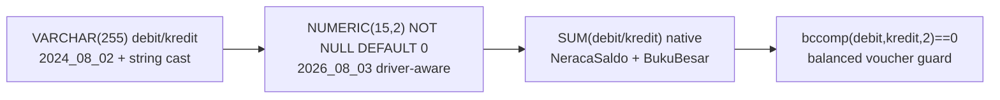

# DAPENSE — Database Portfolio (Single Source)

> Dana Pensiun Sekolah Kristen Salatiga — Pension Fund Accounting System
> **Stack:** MySQL 8.4 (prod OLTP `docker-compose.yml:47`) | PostgreSQL 16-alpine (portable alt `docker-compose.pgsql.yml:56`) | SQLite fallback | Laravel 13 / PHP 8.3 / Eloquent / Livewire 4
> **One active engine via `DB_CONNECTION` (`config/database.php:19`). Migrations driver-aware. 19 migrations = 18 schema + 1 seed.**
> This file merges `cv.md` (3 VERIFIED bullets) + `docs/database-deep-dive.md` (ERD/FK/catalog/timeline) + `docs/sql-showcase.md` (synthetic demo). Keep those as companions; this is the single recruiter/audit entry point. Indonesian terms in *italics*.

---

## 0) TL;DR for Recruiters

- **3NF ERD:** 8 core tables, 8 FKs (`constrained()->onDelete('cascade')`), 3 domain uniques, 19 migrations — hierarchy `HeaderCOA (Kelompok Akun)` 1—N `COA (Akun)` 1—N `Jurnaling (Jurnal)` → `Saldo Awal` / `Neraca Saldo (Trial Balance)`.
- **Correctness:** `NUMERIC(15,2)` (`2026_08_03_000001:13-21`) + `bccomp(...,2)` balanced guard + `SUM(debit/kredit)` reconciliation → accurate General Ledger (*Buku Besar*) / Trial Balance across 1,000 journal lines.
- **Ops:** 4-role RBAC (8 Policies, 4 Gates), AES-256-CBC encrypted backups (30d), MySQL 8.4 ↔ PG 16 portability (driver-aware `USING ::numeric` + `pgloader`).
- **Showcase (synthetic, no PII):** `database/sql-showcase/` — `VIEW`s, `TRIGGER` (XOR), `PROCEDURE` (posting), 3 complex JOINs — all runnable on MySQL 8.4 + PG 16 vs dummy seed (17 headers / 100 COAs / 54 saldo_awal / 1000 journals).

---

## 1) CV Bullets — VERIFIED (file:line)

### Bullet 1 — 3NF Design
> Designed a 3NF database for a pension-fund accounting system, building 8 core tables, 8 foreign keys, 3 unique constraints, and 19 migrations (18 schema states + seed dataset) supporting 100 COAs and 1,000+ journal transactions

| Claim | Source |
|---|---|
| 8 core tables | `database/migrations/*.php` (19 files) — `header_coas, coas, periodes, jurnalings, saldo_awal, neraca_saldos, users, otorisators` (+ infra `cache/jobs/activity_log`) |
| `Header → COA → Journal` hierarchy | `app/Models/COA.php:24`, `Jurnaling.php:47`, `2024_07_12_155920_header.php:19` (`parent_id` self-FK) |
| 8 FKs | `coas.header_coa_id`→`header_coas`, `header_coas.parent_id` (self), `saldo_awal.coa_id`, `saldo_awal.periode_id`, `jurnalings.coa_id`, `jurnalings.periode_id`, `neraca_saldos.coa_id→coas.kode_akun` (VARCHAR FK), `neraca_saldos.periode_id` — all `constrained()->onDelete('cascade')` |
| 3 uniques | `2024_07_12_160105_c_o_a.php:24-25` `UQ(kode_akun)`, `UQ(kode_akun,nama_akun)`; `2026_07_26_000001:12` `UQ(nomor_bukti, periode_id)` (dropped/re-added `2026_08_02_000002`) |
| 19 migrations | `ls database/migrations/*.php | wc -l` → 19 = 18 schema + `2026_09_02_seed_jurnal_coa_dataset.php` |
| 100/17/54/1000 seed | `database/seed_data_jurnal_coa.sql:11-28` (17), `:39-139` (100), `:144-198` (54), `:203ff` (1000 = 500 vouchers ×2) |

### Bullet 2 — Reporting & Integrity
> Optimized financial reporting and data integrity for General Ledger and Trial Balance by implementing composite constraints, indexed foreign keys, and NUMERIC(15,2) financial fields, enabling accurate debit/credit reconciliation across 1,000+ journal entries

| Claim | Source |
|---|---|
| Composite constraints | `2024_07_12_160105:25`, `2026_07_26_000001:12` |
| FK indexes | All 8 FKs auto-indexed via `foreignId()->constrained()` — `2024_08_02_072943:22-23`, `2024_08_10_114736:16,20`, `2024_09_07_064446:17-18` |
| `NUMERIC(15,2)` | `2026_08_03_000001:13-21` (`VARCHAR` `2024_08_02_072943:20-21` → `NUMERIC NOT NULL DEFAULT 0`, PG `USING ::numeric`); `Jurnaling.php:42-43` `decimal:2` |
| Reconciliation | `NeracaSaldoController.php:107,115` `selectRaw SUM` + `saldo_akhir=(awal.debit-kredit)+(mutasi.debit-kredit)`; `PostingControllerRootSuperuser.php:88-95`; `JurnalingController.php:467-468` `bccomp(...,2)===0` |

### Bullet 3 — Platform / RBAC / Backups / Portability
> Managed MySQL 8.4 and PostgreSQL 16 on Ubuntu/Docker, implementing 4-role RBAC, automated AES-256-CBC encrypted backups, and MySQL → PostgreSQL migration tooling for database portability and recovery

| Claim | Source |
|---|---|
| MySQL 8.4 | `docker-compose.yml:48` `image: mysql:8.4`, `config/database.php:32-60`, `.env.example:24` `DB_CONNECTION=mysql` |
| PG 16 | `docker-compose.pgsql.yml:56` `postgres:16-alpine`, `config/database.php:82-95`, `.env.example:36`, `docker-compose.pgsql.yml:21` |
| Ubuntu/Docker | `Dockerfile:1,3` `php:8.3-fpm` + `apt-get nginx redis-server`, harden `cap_drop: ALL` `read_only: true` |
| 4-role RBAC | `2024_06_17_033310_users.php:18` `usertype` default `rootsuperuser` + `admin/operator/bod`; `HasRole` trait, `CheckRole` middleware `bootstrap/app.php:20` |
| 8 Policies + 4 Gates | `app/Policies/*.php` (8): Journal/Ledger/User/Periode/SaldoAwal/Otorisator/Report/Setting; `AuthServiceProvider.php:36-50` `export-journal:36 import-data:40 post-journal:44 manage-users:48` |
| AES-256-CBC | `docker/backup.sh:27` `mysqldump|gzip|openssl enc -aes-256-cbc -salt -pbkdf2`; `backup-pg.sh:38` `pg_dump`; `restore.sh:43` `restore-pg.sh:45`; `config/app.php:98` `cipher AES-256-CBC`; 30d retention |
| Portability | `2026_08_03:12-22` driver-aware, `JurnalCoaSeeder.php:15-35` `TRUNCATE CASCADE` + `setval(pg_get_serial_sequence...)`, `docs/postgres-migration.md`, `database/pgsql-export.sh` |

**Tech Stack line:** `MySQL 8.4 (prod) | PostgreSQL 16 (portable alt) | SQLite (dev/test fallback) | Redis 7 | PHP 8.3 | Laravel 13 | Eloquent | Livewire 4 | Ubuntu | Docker | Nginx | RBAC | AES-256-CBC | Spatie ActivityLog | Pest 4`

**DB Engine Roles (one active):**

| Engine | Role | How it runs |
|---|---|---|
| **MySQL 8.4** | Prod OLTP default `DB_CONNECTION=mysql` `.env.example:24` `docker-compose.yml:47` | All financial tables + Laravel `sessions/cache/queue` (`database` driver) + `SUM` reports; `mysqldump` backups |
| **PostgreSQL 16** | Portable alt `DB_CONNECTION=pgsql` `.env.example:36` `docker-compose.pgsql.yml:21` | Same schema via driver-aware migrations; `pg_dump` backups; `pgloader` guide |
| **SQLite** | Zero-config fallback `config/database.php:37` | Default if `.env` missing; `phpunit.xml:26-27` `:memory:` commented out (needs MySQL for VARCHAR regression) |

---

## 2) ERD — 8 Core Tables (3NF) — Detailed

**Entities (8 core + 3 infra):** `header_coas` → `coas` → `jurnalings / saldo_awal / neraca_saldos` ; `periodes`, `users`, `otorisators`. Infra `cache, jobs, activity_log` excluded from the 8-count. All FKs `foreignId()->constrained()->onDelete('cascade')` — auto-indexed.

### 2.1 Mermaid ERD (full)

```mermaid
erDiagram
    header_coas ||--o{ header_coas : "parent_id self-FK (hierarki akun)"
    header_coas ||--o{ coas : "header_coa_id"
    coas ||--o{ jurnalings : "coa_id"
    coas ||--o{ saldo_awal : "coa_id"
    coas ||--o{ neraca_saldos : "coa_id → kode_akun (VARCHAR FK)"
    periodes ||--o{ jurnalings : "periode_id"
    periodes ||--o{ saldo_awal : "periode_id"
    periodes ||--o{ neraca_saldos : "periode_id"
    users ||--o{ jurnalings : "otorisator (approver)"
    header_coas {
        bigint id PK
        string kode_header "HEADER-01"
        string nama_header
        int level
        bigint parent_id FK "nullable self"
    }
    coas {
        bigint id PK
        string kode_akun UK "AKT-001"
        string nama_akun
        string saldo_normal "D/K"
        string kategori
        int level
        bigint header_coa_id FK
    }
    periodes {
        bigint id PK
        string nama_periode "2024-08"
        boolean is_rekap
        date start_date
        date end_date
    }
    jurnalings {
        bigint id PK
        string nomor_bukti UK_per_periode "VCHR-001"
        bigint coa_id FK
        bigint periode_id FK
        numeric debit "NUMERIC(15,2)"
        numeric kredit "NUMERIC(15,2)"
        string kategori_jurnal
        date tanggal
    }
    saldo_awal {
        bigint id PK
        bigint coa_id FK
        bigint periode_id FK
        numeric debit
        numeric kredit
    }
    neraca_saldos {
        bigint id PK
        string coa_id FK "→ coas.kode_akun"
        bigint periode_id FK
        numeric saldo_awal
        numeric mutasi_debit
        numeric mutasi_kredit
        numeric saldo_akhir
    }
    users {
        bigint id PK
        string usertype "rootsuperuser|admin|operator|bod"
    }
    otorisators {
        bigint id PK
        string nomor_bukti
        string status
    }
```

**Hierarchy read:** `HeaderCOA (Kelompok Akun)` 1—N `COA (Akun)` 1—N `Jurnaling (Jurnal)` — canonical General Ledger (*Buku Besar*) chain. `header_coas.parent_id` enables arbitrary-depth grouping (`2024_07_12_155920_header.php:19`). Models: `COA.php:24` `belongsTo(HeaderCOA)`, `Jurnaling.php:47` `belongsTo(COA)`.

### 2.2 Flowchart — relations & data flow



**How to read the flowchart:**
- **Solid →** physical FK (`constrained()->onDelete('cascade')`, auto-indexed). **Dashed -.->** logical/snapshot FK (natural key `kode_akun`, or approver link).
- **Top chain** is the accounting spine: 5 top headers (`ASET` etc.) → 17 leaf headers → 100 COAs → journals. Each voucher (`Nomor Bukti`) is scoped to one `Periode` (`UQ(nomor_bukti,periode_id)`), kept balanced (`debit XOR kredit`, `bccomp(...,2)`).
- **`saldo_awal`** holds opening balances per `COA × Periode` (54 rows for seed periode 1); **`neraca_saldos`** is the period-close snapshot produced by `sp_posting_periode` (100 rows, one per `kode_akun`).
- **Right column** is the synthetic showcase derived from this spine: two `VIEW`s, one `TRIGGER`, one `PROCEDURE`, plus the 3 JOINs (incl. `WITH` rollup over `header_coas` level 1 `4/5` vs children `4.1/4.2/5.1/5.2/5.3`).

### 2.3 FK Catalogue — 8 FKs

| # | FK | From → To | Migration | On Delete | Index |
|---|---|---|---|---|---|
| 1 | `coas.header_coa_id` | `coas` → `header_coas.id` | `2024_07_12_160105_c_o_a.php:19` | `cascade` | auto |
| 2 | `header_coas.parent_id` | `header_coas` → `header_coas.id` (self) | `2024_07_12_155920_header.php:19` | `cascade` (nullable) | auto |
| 3 | `saldo_awal.coa_id` | `saldo_awal` → `coas.id` | `2024_08_10_114736_create_saldo_awals_table.php:16` | `cascade` | auto |
| 4 | `saldo_awal.periode_id` | `saldo_awal` → `periodes.id` | `2024_08_10_114736_create_saldo_awals_table.php:20` | `cascade` | auto |
| 5 | `jurnalings.coa_id` | `jurnalings` → `coas.id` | `2024_08_02_072943_jurnalings.php:22` | `cascade` | auto |
| 6 | `jurnalings.periode_id` | `jurnalings` → `periodes.id` | `2024_08_02_072943_jurnalings.php:23` | `cascade` | auto |
| 7 | `neraca_saldos.coa_id` | `neraca_saldos` → `coas.kode_akun` (VARCHAR FK) | `2024_09_07_064446_create_neraca_saldos_table.php:17` | `cascade` | auto |
| 8 | `neraca_saldos.periode_id` | `neraca_saldos` → `periodes.id` | `2024_09_07_064446_create_neraca_saldos_table.php:18` | `cascade` | auto |

Verified `grep -rn constrained database/migrations` → 8 hits. **Note:** `neraca_saldos.coa_id → kode_akun` is intentional natural-key FK for Trial Balance snapshots.

### 2.4 Unique Constraints — 3 Domain Uniques

| Constraint | Columns | Migration | Purpose |
|---|---|---|---|
| `UQ(coas.kode_akun)` | `kode_akun` | `2024_07_12_160105_c_o_a.php:24` | Chart of Accounts uniqueness |
| `UQ(coas.kode_akun, nama_akun)` | `kode_akun + nama_akun` | `2024_07_12_160105_c_o_a.php:25` | Composite dedup |
| `UQ(jurnalings.nomor_bukti, periode_id)` | `nomor_bukti + periode_id` | `2026_07_26_000001:12` (re-added `2026_08_02_000002`) | Voucher integrity per *Periode* |

---

## 3) Migration Timeline — 19 Files (18 Schema + 1 Seed)

```
0001_01_01_000000  must (infra)
0001_01_01_000001  cache  (sessions/cache/queue on database driver)
0001_01_01_000002  jobs   (infra)
2024_06_17_033310  users (usertype: rootsuperuser|admin|operator|bod)  :18
2024_07_09_044815  periodes (is_rekap lifecycle)                         :46
2024_07_12_155920  header_coas (self-FK parent_id)                      :19
2024_07_12_160105  coas (2 uniques, header_coa_id FK)                   :24-25
2024_08_02_072943  jurnalings (coa_id+periode_id FKs, VARCHAR debit/kredit) :20-23
2024_08_10_114736  saldo_awal (opening per COA×Periode)                 :16,20
2024_09_06_023522  add kategori_jurnal to jurnalings
2024_09_07_064446  neraca_saldos (Trial Balance snapshot, VARCHAR FK)
2025_12_04_020125  otorisators (approver ledger)
2026_07_15_142905  activity_log (Spatie)
2026_07_15_142906  activity_log.add_event
2026_07_15_142907  activity_log.add_batch_uuid
2026_07_26_000001  UQ(nomor_bukti, periode_id)  ADD
2026_08_02_000002  UQ(nomor_bukti, periode_id)  DROP+RE-ADD (otorisator fix)
2026_08_03_000001  NUMERIC(15,2) conversion  ★ driver-aware
2026_09_02_000000  seed_jurnal_coa_dataset (dataset-as-migration)
 ────────────────  + seed_data_jurnal_coa.sql (17 headers / 100 COAs / 54 saldo_awal / 1000 jurnalings)
```

`ls database/migrations/*.php | wc -l` → **19**.

---

## 4) Seed Dataset — Counts Verified

| Dataset | File:lines | Rows | Detail |
|---|---|---|---|
| Header COA | `seed_data_jurnal_coa.sql:11-28` | **17** | `INSERT INTO header_coas` |
| COA | `seed_data_jurnal_coa.sql:39-139` | **100** | `AKT-* / PAS-* / MOD-* / PEND-* / BIAYA-*` |
| Saldo Awal | `seed_data_jurnal_coa.sql:144-198` | **54** | Opening per `periode_id=1` |
| Jurnaling | `seed_data_jurnal_coa.sql:203ff` | **1,000** (500 vouchers ×2) | Double-entry journals |
| Periode | `seed_data_jurnal_coa.sql` + `2024_07_09_044815` | 1+ | `Tahun 2025`, drives `periode_id` |

Loaded via `JurnalCoaSeeder.php:15-35` (`TRUNCATE CASCADE` + `setval(pg_get_serial_sequence(...))` for PG) + `2026_09_02_000000`.

---

## 5) Optimization — VARCHAR → NUMERIC(15,2) (Before / After)

**Before:** `jurnalings.debit/kredit` were `VARCHAR(255)` (`2024_08_02_072943:20-21` `string('debit')`) — `SUM` required implicit cast, risked string-sort/rounding in *Buku Besar / Neraca Saldo*.

**Migration:** `2026_08_03_000001:13-21`

```php
// BEFORE: $table->string('debit'); $table->string('kredit');
// AFTER: driver-aware
if (DB::getDriverName() === 'pgsql') {
    DB::statement("ALTER TABLE jurnalings ALTER COLUMN debit TYPE NUMERIC(15,2) USING debit::numeric");
    DB::statement("ALTER TABLE jurnalings ALTER COLUMN kredit TYPE NUMERIC(15,2) USING kredit::numeric");
} else {
    DB::statement("ALTER TABLE jurnalings MODIFY COLUMN debit NUMERIC(15,2) NOT NULL DEFAULT 0");
    DB::statement("ALTER TABLE jurnalings MODIFY COLUMN kredit NUMERIC(15,2) NOT NULL DEFAULT 0");
}
```

Model cast `Jurnaling.php:42-43` `'debit' => 'decimal:2'`. Impact:

```php
// NeracaSaldoController.php:107,115
selectRaw('SUM(debit) as total_debit, SUM(kredit) as total_kredit')
saldo_akhir = (saldoAwal.debit - saldoAwal.kredit) + (total_debit - total_kredit)
// PostingControllerRootSuperuser.php:88-95, JurnalingController.php:467-468
if (bccomp($debitSum, $kreditSum, 2) !== 0) throw // debit === kredit per voucher
```



Verify `docs/postgres-migration.md:101` — `NUMERIC(15,2)` on both engines.

### Indexes & Integrity
- 8 FKs auto-indexed; `UQ(...)` doubles as lookup index. `EXPLAIN WHERE coa_id=? AND periode_id=?` hits FK path.
- No RLS (`docs/postgres-migration.md:105`) — auth is app-level (see §6).

---

## 6) RBAC — 4 Roles, HasRole, CheckRole, 8 Policies, 4 Gates

| Layer | Source | Detail |
|---|---|---|
| Roles (4) | `2024_06_17_033310_users.php:18` `users.usertype` | `rootsuperuser` (super admin) / `admin` / `operator` (entry) / `bod` (Board) |
| Trait | `app/Traits/HasRole.php` | `hasRole(string|array)` |
| Middleware | `bootstrap/app.php:20` `CheckRole` | `->middleware('role:rootsuperuser,admin')` |
| Policies (8) | `app/Policies/*.php` | Journal, Ledger, User, Periode, SaldoAwal, Otorisator, Report, Setting |
| Gates (4) | `AuthServiceProvider.php:36-50` | `export-journal:36` `import-data:40` `post-journal:44` `manage-users:48` |
| Audit | `spatie/laravel-activitylog` `2026_07_15_142905` | `activity_log` + `event` + `batch_uuid` |

`operator` writes journals, `rootsuperuser` posts & manages periods/users, `bod` reads reports, `admin` manages masters — server-side enforced (`AGENTS.md:14`).

---

## 7) Backup & Recovery — AES-256-CBC, 30-day

| Path | Source | Command |
|---|---|---|
| MySQL backup | `docker/backup.sh:27` | `mysqldump | gzip | openssl enc -aes-256-cbc -salt -pbkdf2 -pass $BACKUP_ENCRYPTION_KEY > /backups/dapense_*.sql.enc` |
| PG backup | `docker/backup-pg.sh:38` | `pg_dump | gzip | openssl enc -aes-256-cbc -salt -pbkdf2` |
| MySQL restore | `docker/restore.sh:43` | `openssl enc -d ... | gunzip | mysql` |
| PG restore | `docker/restore-pg.sh:45` | `openssl enc -d ... | gunzip | psql` |
| Cipher | `config/app.php:98` | `AES-256-CBC` |
| Retention | `docker/backup*.sh` | 30 days cron-friendly |

---

## 8) Portability — MySQL 8.4 ↔ PostgreSQL 16

| Area | MySQL | PostgreSQL | Source |
|---|---|---|---|
| Active engine | `DB_CONNECTION=mysql` `.env.example:24` | `DB_CONNECTION=pgsql` `.env.example:36` `docker-compose.pgsql.yml:21` | `config/database.php:19,32-60,82-95` |
| Schema | `BIGINT UNSIGNED` backticks `MODIFY` | `BIGINT` no backticks `ALTER TYPE ... USING ::numeric` | `2026_08_03:13-21` |
| Seed | `seed_data_jurnal_coa.sql` | **PG-compatible** plain `INSERT` | `docs/postgres-migration.md:12` |
| Live migration | `mysqldump` | `pgloader mysql://... pgsql://...` | `docs/postgres-migration.md:64-66` |
| Export | — | `./database/pgsql-export.sh → pgsql-dump/full.sql` | `docs/postgres-migration.md:89-95` |
| SQLite | default if `.env` missing `config/database.php:37` | `:memory:` commented out `phpunit.xml:26-27` | needs MySQL for VARCHAR regression |

---

## 9) SQL Showcase — Synthetic Demo (no PII)

> Derived from the same seed (`17/100/54/1000`) and schema above. **Do not paste production dumps / `.env` / `BACKUP_ENCRYPTION_KEY` into public repos.** Runnable on both engines.

### 9.1 What you will find

| File | What it proves | Mirrors |
|---|---|---|
| `database/sql-showcase/01_views.sql` | `v_neraca_saldo` + `v_buku_besar` (`OVER PARTITION BY` running balance) | `NeracaSaldoController:107,135` · `BukuBesarController:56,119,189` |
| `database/sql-showcase/02_triggers.sql` | `trg_jurnal_balance_check` `debit XOR kredit` | `JurnalingController:467-468` `bccomp` |
| `database/sql-showcase/03_procedures.sql` | `sp_posting_periode(p_periode_id)` transactional snapshot | `PostingController:88-95` |
| `database/sql-showcase/04_complex_joins.sql` | 3 JOINs: Buku Besar per COA×bulan, Neraca `LEFT JOIN` (all 100 COAs), Laba-Rugi `WITH` CTE + voucher audit | `NeracaSaldoController:107` · `seed_data:11ff` |

### 9.2 Quick start (either engine)

```bash
# MySQL 8.4
docker compose up --build -d && docker compose exec app php artisan migrate --force
docker compose exec mysql mysql -u root -p"$DB_PASSWORD" dapense < database/seed_data_jurnal_coa.sql
for f in database/sql-showcase/*.sql; do docker compose exec mysql mysql -u root -p"$DB_PASSWORD" dapense < "$f"; done

# PostgreSQL 16
docker compose -f docker-compose.pgsql.yml up --build -d && docker compose -f docker-compose.pgsql.yml exec app php artisan migrate --force
docker compose -f docker-compose.pgsql.yml exec postgres psql -U postgres -d dapense -f database/seed_data_jurnal_coa.sql
for f in database/sql-showcase/*.sql; do docker compose -f docker-compose.pgsql.yml exec postgres psql -U postgres -d dapense -f "$f"; done
```

Verify:
```sql
SELECT COUNT(*) FROM coas; -- 100
SELECT * FROM v_neraca_saldo WHERE periode_id=1 LIMIT 5;
SELECT * FROM v_buku_besar WHERE kode_akun='10010001' ORDER BY tanggal LIMIT 5;
CALL sp_posting_periode(1); SELECT COUNT(*) FROM neraca_saldos WHERE periode_id=1; -- 100
```

### 9.3 View highlights

- `v_neraca_saldo`: `JOIN coas+header_coas+periodes` + `LEFT JOIN saldo_awal` + `GROUP BY kode_akun` → `saldo_akhir = (awal.debit-kredit)+(mutasi.debit-kredit)`. PG `::NUMERIC(15,2)` casts, MySQL plain `SUM`.
- `v_buku_besar`: `SUM(debit-kredit) OVER (PARTITION BY coa_id ORDER BY tanggal,id)` *saldo berjalan*. `EXTRACT(MONTH FROM tanggal)` PG-native, MySQL-compatible (`docs/postgres-migration.md:104`).

### 9.4 Trigger — `trg_jurnal_balance_check`

- MySQL `BEFORE INSERT/UPDATE` `SIGNAL SQLSTATE '45000'` on `NOT (debit>0 XOR kredit>0)`.
- PG `FUNCTION fn_jurnal_balance_check() RETURNS TRIGGER` + `BEFORE INSERT OR UPDATE EXECUTE FUNCTION`.

Invalid (both 0/ both >0/ negatives/ NULL) rejected at DB layer — complement to app `bccomp`.

### 9.5 Procedure — `sp_posting_periode(p_periode_id)`

1. Count unbalanced vouchers `GROUP BY nomor_bukti HAVING ABS(SUM(debit)-SUM(kredit))>0.005`. If >0 → `SIGNAL`/`RAISE`.
2. `DELETE FROM neraca_saldos WHERE periode_id=p` + `INSERT ... SELECT` per `kode_akun` with `COALESCE` + `NOW()`. Idempotent `CALL`.

### 9.6 3 Complex JOINs + Bonus

- **Q1 Buku Besar per COA×bulan:** `JOIN jurnalings→coas→header_coas→periodes`, `EXTRACT(MONTH)`, `GROUP BY kode_akun, bulan`, `HAVING net<>0`.
- **Q2 Neraca lengkap:** `LEFT JOIN saldo_awal` + `LEFT JOIN (SELECT coa_id, SUM...)` so all 100 COAs appear — `LEFT JOIN` vs `INNER` signal.
- **Q3 Laba-Rugi:** `WITH coa_mutasi, header_rollup` over `header_coas` hierarchy (`4/5` → `4.1/4.2/5.1/5.2/5.3`) rollup `PENDAPATAN` vs `BEBAN` → `laba_rugi`.
- **Bonus:** `GROUP BY nomor_bukti HAVING ABS(SUM(debit)-SUM(kredit))>0.005` — expect 0 rows (500 vouchers balanced).

### 9.7 For recruiters — 2 minutes

```sql
SELECT kode_akun, mutasi_debit, mutasi_kredit, saldo_akhir FROM v_neraca_saldo WHERE periode_id=1 ORDER BY kode_akun LIMIT 10;
INSERT INTO jurnalings (nomor_bukti,coa_id,periode_id,debit,kredit,tanggal,keterangan) VALUES ('RECRUITER-OK',1,1,50000,0,'2025-06-15','ok');
INSERT INTO jurnalings (nomor_bukti,coa_id,periode_id,debit,kredit,tanggal,keterangan) VALUES ('RECRUITER-BAD',1,1,50000,50000,'2025-06-15','should fail');
CALL sp_posting_periode(1); SELECT COUNT(*) FROM neraca_saldos WHERE periode_id=1;
```

---

## 10) Citation Index (file:line)

`database/migrations/2024_07_12_155920_header.php:19` · `2024_07_12_160105_c_o_a.php:19,24-25` · `2024_08_02_072943_jurnalings.php:20-23` · `2024_08_10_114736_create_saldo_awals_table.php:16,20` · `2024_09_07_064446_create_neraca_saldos_table.php:17-18` · `2026_07_26_000001_add_unique_nomor_bukti_per_periode.php:12` · `2026_08_02_000002_drop_unique_nomor_bukti_per_periode.php` · `2026_08_03_000001_convert_jurnalings_debit_kredit_to_numeric.php:13-21` · `2026_09_02_000000_seed_jurnal_coa_dataset.php` · `database/seed_data_jurnal_coa.sql:11-28,39-139,144-198,203ff` · `app/Models/COA.php:24` · `app/Models/Jurnaling.php:42-43,47` · `app/Http/Controllers/Base/NeracaSaldoController.php:107,115,135` · `app/Http/Controllers/Base/BukuBesarController.php:56,119,189` · `app/Http/Controllers/rootsuperuser/PostingControllerRootSuperuser.php:29,88-95` · `app/Http/Controllers/Base/JurnalingController.php:467-468,741-753` · `config/database.php:19,32-60,82-95` · `docker-compose.yml:47-48` · `docker-compose.pgsql.yml:21,56` · `.env.example:24,36` · `phpunit.xml:26-27` · `app/Providers/AuthServiceProvider.php:36-50` · `bootstrap/app.php:20` · `app/Traits/HasRole.php` · `app/Policies/*.php` (8) · `docker/backup.sh:27` · `docker/backup-pg.sh:38` · `docker/restore.sh:43` · `docker/restore-pg.sh:45` · `config/app.php:98` · `docs/postgres-migration.md:101,104,105` · `database/sql-showcase/01_views.sql` · `02_triggers.sql` · `03_procedures.sql` · `04_complex_joins.sql` · `docs/database-deep-dive.md` · `docs/sql-showcase.md` · `cv.md`

---

*Single-source portfolio merging `cv.md` + `docs/database-deep-dive.md` + `docs/sql-showcase.md`. For deep ERD flowchart see §2.2. All claims VERIFIED; showcase is synthetic anonymized (no PII/production data).*
