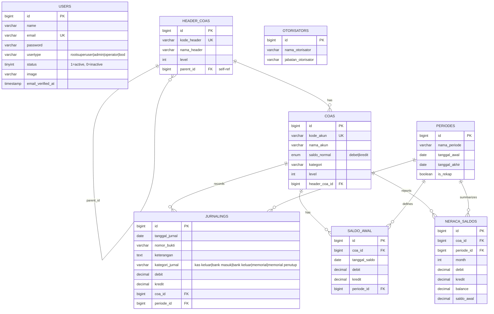
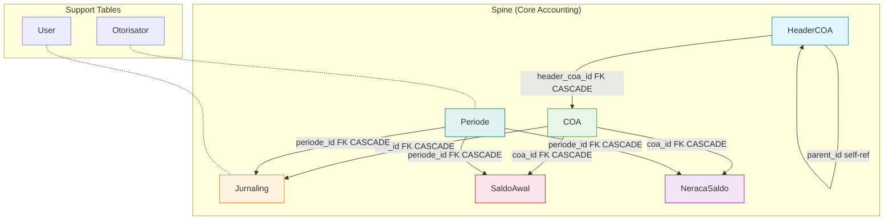

# Entity-Relationship Diagram — DAPENSE

> Visual model of all database tables, relationships, and constraints.

## 1. ER Diagram (Mermaid)



## 2. Relationship Flowchart



## 3. Relationship Catalogue

### 3.1 Self-Referencing

| Relationship | FK | Cardinality | On Delete |
|-------------|-----|-------------|-----------|
| HeaderCOA → HeaderCOA | `parent_id → id` | 0..N → 0..1 | SET NULL |

### 3.2 One-to-Many

| Parent | Child | FK | Cardinality | On Delete |
|--------|-------|-----|-------------|-----------|
| HeaderCOA | COA | `header_coa_id → id` | 1 → 0..N | CASCADE |
| COA | Jurnaling | `coa_id → id` | 1 → 0..N | CASCADE |
| COA | SaldoAwal | `coa_id → id` | 1 → 0..N | CASCADE |
| COA | NeracaSaldo | `coa_id → id` | 1 → 0..N | CASCADE |
| Periode | Jurnaling | `periode_id → id` | 1 → 0..N | CASCADE |
| Periode | SaldoAwal | `periode_id → id` | 1 → 0..N | CASCADE |
| Periode | NeracaSaldo | `periode_id → id` | 1 → 0..N | CASCADE |

### 3.3 Key Design Patterns

| Pattern | Implementation |
|---------|---------------|
| **Hierarchical COA** | `header_coas.parent_id` self-referencing FK enables multi-level account grouping (Asset → Current Assets → Cash) |
| **Double-entry spine** | `jurnalings.debit` + `jurnalings.kredit` per COA per period — balanced at trigger level |
| **Period isolation** | All financial data (`jurnaling`, `saldo_awal`, `neraca_saldo`) scoped to `periode_id` |
| **Snapshot pattern** | `neraca_saldos` stores pre-computed period-end balances for fast report queries |
| **Natural key uniqueness** | `header_coas.kode_header` and `coas.kode_akun` are UNIQUE — human-readable identifiers |
| **Cascade deletion** | Deleting a COA cascades to all journal lines, opening balances, and trial balance records |
| **Approver metadata** | `otorisators` is standalone — referenced by name in journal approvals, not FK-linked |

## 4. Data Flow

```
                    ┌──────────────┐
                    │  HeaderCOA   │  ← Account grouping hierarchy
                    └──────┬───────┘
                           │ 1:N
                    ┌──────▼───────┐
                    │     COA      │  ← 100 accounts ( kode_akun UNIQUE )
                    └──────┬───────┘
                           │
              ┌────────────┼────────────┐
              │ 1:N        │ 1:N        │ 1:N
       ┌──────▼──────┐ ┌──▼────────┐ ┌──▼──────────┐
       │  Jurnaling   │ │ SaldoAwal │ │ NeracaSaldo │
       │  (1000+)     │ │ (54)      │ │ (computed)  │
       └──────┬───────┘ └──┬────────┘ └──┬──────────┘
              │            │              │
              └────────────┼──────────────┘
                           │ N:1
                    ┌──────▼───────┐
                    │   Periode    │  ← Accounting period
                    └──────────────┘
```

## 5. Eloquent Relationship Map

```php
// HeaderCOA
headerCoa->parent()    // BelongsTo HeaderCOA
headerCoa->children()  // HasMany HeaderCOA
headerCoa->coas()      // HasMany COA

// COA
coa->headerCoa()       // BelongsTo HeaderCOA
coa->jurnalings()      // HasMany Jurnaling

// Jurnaling
jurnaling->coa()       // BelongsTo COA
jurnaling->periode()   // BelongsTo Periode

// SaldoAwal
saldoAwal->coa()       // BelongsTo COA
saldoAwal->periode()   // BelongsTo Periode

// NeracaSaldo
neracaSaldo->coa()     // BelongsTo COA (by kode_akun)
neracaSaldo->periode() // BelongsTo Periode
```

## 6. Seed Data Distribution

| Table | Row Count | Source |
|-------|-----------|--------|
| `header_coas` | 17 | JurnalCoaSeeder |
| `coas` | 100 | JurnalCoaSeeder |
| `jurnalings` | 1,000+ | JurnalCoaSeeder |
| `saldo_awal` | 54 | JurnalCoaSeeder |
| `periodes` | varies | PeriodeManager |
| `otorisators` | varies | OtorisatorManager |
| `users` | 4 (role admin) | UsersTableSeeder |
