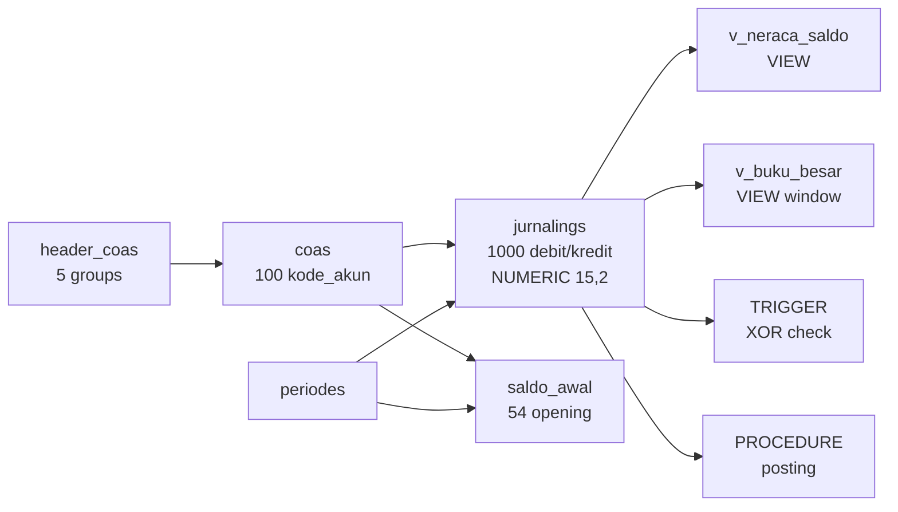

# SQL Showcase — DAPENSE (Synthetic, Recruiter-Ready)

> **SYNTHETIC DEMO — anonymized from DAPENSE schema.** No PII, no production balances, no secrets. Derived from `database/seed_data_jurnal_coa.sql` (17 header_coas, 100 coas, 54 saldo_awal, 1000 jurnalings) and `database/migrations/*` (8 FKs, 3 UQs, `NUMERIC(15,2)` at `2026_08_03_000001`).
> **Purpose:** Answer the recruiter ask for *stored procedures / triggers / views / complex JOINs* without publishing private project code. Everything here is **runnable** on both **MySQL 8.4** (`docker-compose.yml:47` `dapense-mysql`) and **PostgreSQL 16-alpine** (`docker-compose.pgsql.yml:56` `dapense-postgres`) — one active via `DB_CONNECTION` (`config/database.php:19`).

Companion: `docs/database-deep-dive.md` (ERD + FK catalogue + migration timeline). Bullets: `cv.md`.

---

## 1) What you will find

| File | What it proves | Mirrors in app |
|---|---|---|
| `database/sql-showcase/01_views.sql` | `VIEW v_neraca_saldo` (Trial Balance) + `VIEW v_buku_besar` (General Ledger with running balance `OVER PARTITION BY`) | `NeracaSaldoController.php:107,135` · `BukuBesarController.php:56,119,189` |
| `database/sql-showcase/02_triggers.sql` | `TRIGGER trg_jurnal_balance_check` — DB-layer double-entry guard (`debit XOR kredit`) | `JurnalingController.php:467-468` `bccomp(...,2)` |
| `database/sql-showcase/03_procedures.sql` | `PROCEDURE sp_posting_periode(p_periode_id)` — voucher-balanced check + `neraca_saldos` snapshot, transactional | `PostingControllerRootSuperuser.php:29,88-95` |
| `database/sql-showcase/04_complex_joins.sql` | 3 complex JOINs: Buku Besar per COA×bulan, Neraca Saldo `LEFT JOIN` (zero-mutation COAs), Laba-Rugi via header hierarchy + CTE rollup + voucher audit | `NeracaSaldoController:107` · `BukuBesarController:56` · `seed_data_jurnal_coa.sql:11ff` |

All files header-commented `-- SYNTHETIC DEMO — ... safe for public review`.



---

## 2) Quick start (either engine)

```bash
# MySQL 8.4 (default)
docker compose up --build -d
docker compose exec app php artisan migrate --force
docker compose exec app psql # or mysql — load seed
# load seed
docker compose exec mysql mysql -u root -p"$DB_PASSWORD" dapense < database/seed_data_jurnal_coa.sql
# or: docker compose exec app php artisan db:seed --class=DatabaseSeeder

# then run showcase
docker compose exec mysql mysql -u root -p"$DB_PASSWORD" dapense < database/sql-showcase/01_views.sql
docker compose exec mysql mysql -u root -p"$DB_PASSWORD" dapense < database/sql-showcase/02_triggers.sql
docker compose exec mysql mysql -u root -p"$DB_PASSWORD" dapense < database/sql-showcase/03_procedures.sql
docker compose exec mysql mysql -u root -p"$DB_PASSWORD" dapense < database/sql-showcase/04_complex_joins.sql

# PostgreSQL 16
docker compose -f docker-compose.pgsql.yml up --build -d
docker compose -f docker-compose.pgsql.yml exec app php artisan migrate --force
docker compose -f docker-compose.pgsql.yml exec postgres psql -U postgres -d dapense -f database/seed_data_jurnal_coa.sql
docker compose -f docker-compose.pgsql.yml exec postgres psql -U postgres -d dapense -f database/sql-showcase/01_views.sql
# ... repeat for 02-04
```

Verify row counts match seed:
```sql
SELECT COUNT(*) FROM coas;         -- 100
SELECT COUNT(*) FROM header_coas;  -- 17
SELECT COUNT(*) FROM jurnalings;   -- 1000
SELECT * FROM v_neraca_saldo WHERE periode_id=1 LIMIT 5;
SELECT * FROM v_buku_besar WHERE kode_akun='10010001' ORDER BY tanggal LIMIT 5;
CALL sp_posting_periode(1); SELECT COUNT(*) FROM neraca_saldos WHERE periode_id=1; -- expect 100
```

---

## 3) Design notes — why this is **not** just syntax

**3NF & hierarchy (Buku Besar chain).** `header_coas.parent_id` self-FK (`2024_07_12_155920_header.php:19`) → `coas.header_coa_id` (`2024_07_12_160105_c_o_a.php:19`) → `jurnalings.coa_id/periode_id` (`2024_08_02_072943_jurnalings.php:22-23`). Views reuse this chain; no denormalization except the deliberate `neraca_saldos.coa_id → coas.kode_akun` VARCHAR FK (`2024_09_07_064446_create_neraca_saldos_table.php:17`) for snapshot reporting.

**Financial correctness.** Columns are `NUMERIC(15,2)` (`2026_08_03_000001:13-21`) with model casts `decimal:2` (`app/Models/Jurnaling.php:42-43`). Aggregation is `SUM(debit) - SUM(kredit)` with `COALESCE(...,0)` and `saldo_akhir = (awal.debit-kredit)+(mutasi.debit-kredit)` (`NeracaSaldoController:115`). Procedures/triggers replicate that logic in SQL so the DB can enforce it even if the app is bypassed.

**Period scoping & voucher integrity.** `UNIQUE(nomor_bukti, periode_id)` (`2026_07_26_000001:12`, re-added `2026_08_02_000002`) guarantees `Nomor Bukti` per `Periode`; period closing (`sp_posting_periode`) checks `HAVING ABS(SUM(debit)-SUM(kredit))>0.005` per voucher — mirrors `bccomp` in controllers.

**No production leakage.** Showcase reads only the dummy seed; `docker/backup*.sh` encrypted dumps and `.env` secrets are never referenced.

---

## 4) View file details

### `01_views.sql` — `v_neraca_saldo` & `v_buku_besar`

- `v_neraca_saldo`: `JOIN coas+header_coas+periodes` + `LEFT JOIN saldo_awal` + `GROUP BY kode_akun` → `saldo_akhir` formula. Dual-dialect: `::NUMERIC(15,2)` for PG, plain `SUM` for MySQL.
- `v_buku_besar`: `SUM(debit-kredit) OVER (PARTITION BY coa_id ORDER BY tanggal,id)` running balance (*saldo berjalan*). Uses `EXTRACT(MONTH FROM tanggal)` which is PG-native and MySQL-compatible (`docs/postgres-migration.md:104`).

Recruiter check: `SELECT COUNT(*) FROM v_neraca_saldo` → ≤100 rows; `SELECT * FROM v_buku_besar WHERE kode_akun='10010001'`.

### `02_triggers.sql` — `trg_jurnal_balance_check`

- **MySQL:** `BEFORE INSERT/UPDATE`, `SIGNAL SQLSTATE '45000'` on `NOT (debit>0 XOR kredit>0)`.
- **PostgreSQL:** `FUNCTION fn_jurnal_balance_check() RETURNS TRIGGER` + `BEFORE INSERT OR UPDATE ... EXECUTE FUNCTION`.

Invalid rows (both 0, both >0, negatives, NULL) are rejected at the DB layer — a complement to the app `bccomp` guard.

### `03_procedures.sql` — `sp_posting_periode(p_periode_id)`

1. Count unbalanced vouchers (`GROUP BY nomor_bukti HAVING SUM(debit)!=SUM(kredit)`). If >0, `SIGNAL`/`RAISE EXCEPTION` and abort.
2. `DELETE FROM neraca_saldos WHERE periode_id=p` + `INSERT ... SELECT` snapshot per `kode_akun` with `COALESCE` and `NOW()` timestamps.

Idempotent — safe to `CALL` repeatedly. Mirrors `PostingControllerRootSuperuser.php:88-95`.

### `04_complex_joins.sql` — 3 JOINs + bonus audit

- **Q1 Buku Besar per COA×bulan:** `JOIN jurnalings→coas→header_coas→periodes`, `EXTRACT(MONTH)`, `GROUP BY kode_akun, bulan`, `HAVING net<>0`, `ORDER BY`. Tests monthly aggregation.
- **Q2 Neraca Saldo lengkap:** `LEFT JOIN saldo_awal` + `LEFT JOIN (SELECT coa_id, SUM...)` so all 100 COAs appear even with zero mutation — `LEFT JOIN` vs `INNER` signal.
- **Q3 Laba-Rugi:** `WITH coa_mutasi AS ... , header_rollup AS ...` CTEs over `header_coas` hierarchy (`kode_header '4'/'5'` → `4.1/4.2/5.1/5.2/5.3`) to roll up PENDAPATAN vs BEBAN and compute `laba_rugi`.
- **Bonus:** `GROUP BY nomor_bukti HAVING ABS(SUM(debit)-SUM(kredit))>0.005` — expect 0 rows on clean seed (500 vouchers balanced).

---

## 5) For recruiters — what to run in 2 minutes

```sql
-- 1. Trial Balance sanity (should return ≤100 rows, saldo_akhir numeric)
SELECT kode_akun, nama_akun, mutasi_debit, mutasi_kredit, saldo_akhir FROM v_neraca_saldo WHERE periode_id=1 ORDER BY kode_akun LIMIT 10;

-- 2. Trigger guard (second INSERT should error)
INSERT INTO jurnalings (nomor_bukti, coa_id, periode_id, debit, kredit, tanggal, keterangan) VALUES ('RECRUITER-OK', 1, 1, 50000, 0, '2025-06-15', 'demo ok');
INSERT INTO jurnalings (nomor_bukti, coa_id, periode_id, debit, kredit, tanggal, keterangan) VALUES ('RECRUITER-BAD', 1, 1, 50000, 50000, '2025-06-15', 'should fail');

-- 3. Posting (should snapshot 100 rows)
CALL sp_posting_periode(1);
SELECT COUNT(*) AS neraca_rows FROM neraca_saldos WHERE periode_id=1;
```

---

## 6) Citation index (file:line)

`database/seed_data_jurnal_coa.sql:11-28,39-139,144-198,203ff` · `database/migrations/2024_07_12_155920_header.php:19` · `2024_07_12_160105_c_o_a.php:19,24-25` · `2024_08_02_072943_jurnalings.php:22-23` · `2024_08_10_114736_create_saldo_awals_table.php:16,20` · `2024_09_07_064446_create_neraca_saldos_table.php:17-18` · `2026_08_03_000001_convert_jurnalings_debit_kredit_to_numeric.php:13-21` · `app/Models/Jurnaling.php:42-43` · `app/Http/Controllers/Base/NeracaSaldoController.php:107,115,135` · `app/Http/Controllers/Base/BukuBesarController.php:56,119,189` · `app/Http/Controllers/Base/JurnalingController.php:467-468` · `app/Http/Controllers/rootsuperuser/PostingControllerRootSuperuser.php:29,88-95` · `docs/postgres-migration.md:104` · `config/database.php:19` · `docker-compose.yml:47` · `docker-compose.pgsql.yml:56`

---

*All showcase SQL is synthetic and anonymized. Do not paste production dumps, `.env` values, or `BACKUP_ENCRYPTION_KEY` into public repos. See `docs/database-deep-dive.md` for the full ERD/FK catalogue/migration timeline.*
